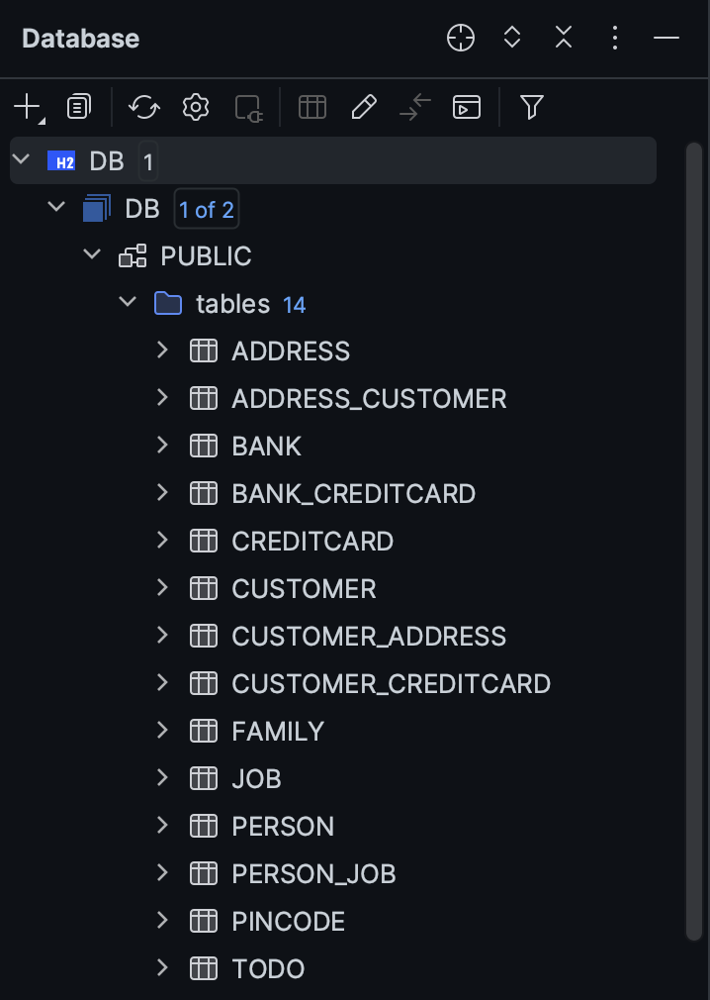

### Experiment 1
Encountered a problem when performing gradle run. I had Java version 22 installed,
but the gradle build file specifies a java version of 21: 
```
    toolchain {
        languageVersion = JavaLanguageVersion.of(21)
    }
```
So I had to install and change to Java 21 for the main class to run. 
Then when following the tutorial, I couldn't understand why the tests didn't pass. 
But I figured i had to put:
```xml
        <class>no.hvl.dat250.jpa.tutorial.relationshipexample.Family</class>
        <class>no.hvl.dat250.jpa.tutorial.relationshipexample.Job</class>
        <class>no.hvl.dat250.jpa.tutorial.relationshipexample.Person</class>
```
In [persistence.xml](https://github.com/vetlemknutsen/dat250-jpa-tutorial/blob/master/src/main/resources/META-INF/persistence.xml) For Hibernate to be able to manage them. 
After that, everything worked fine. 

### Experiment 2
Implementations: [Experiment 2 classes](https://github.com/vetlemknutsen/dat250-jpa-tutorial/tree/master/src/main/java/no/hvl/dat250/jpa/tutorial/creditcards)


**Explain the used database and how/when it runs.**
<br>
The databased used is H2, which is a in-memory database. When running the application, the 
tables are created and put in *DB.mv.db* 

**Can you provide the SQL used to create the table Customer?**
```sql
CREATE TABLE Customer (
    id BIGINT AUTO_INCREMENT PRIMARY KEY,
    name VARCHAR(255)
);
```
No primary or foreign keys were specified, but they could be set with *PRIMARY KEY ()*


**Find a way to inspect the database tables being created and create a database schema in your report. Do the created tables correspond to your initial thoughts regarding the exercise?**
<br>
This is actually quite easy to do, as IntelliJ has a built in SQL plugin, where you can see the database like this: 
<br>

<br>
And it corresponds to my initial thoughts regarding the exercise.


For persisting the objects, I first instantiated the entities, set their attributes and linked them together 
with for example *addOwner* adding a customer to an address.
Then i used *persist()* to persist each entity. 
<br>
Link: [CreditCardsMain](https://github.com/vetlemknutsen/dat250-jpa-tutorial/blob/master/src/main/java/no/hvl/dat250/jpa/tutorial/creditcards/driver/CreditCardsMain.java)
<br><br>
At last, the tests passed. 